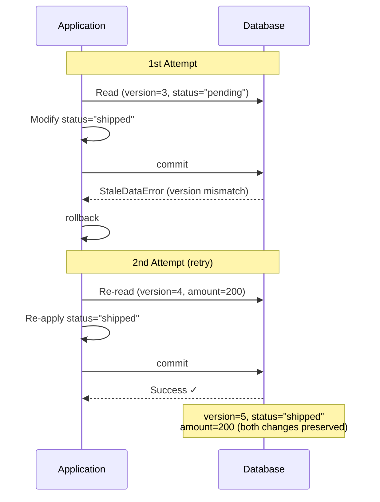

# Optimistic locking mechanism

::: tip Source location
`src/sqlmodel_ext/mixins/optimistic_lock.py` — `OptimisticLockMixin` and `OptimisticLockError`

Retry logic lives in `src/sqlmodel_ext/mixins/table.py`'s `save()` / `update()` methods.
:::

## Why this exists

Concurrent updates on the same record cause **lost updates**: A modifies `status`, B simultaneously modifies `amount`, and whoever writes last overwrites the other's changes. Optimistic locking detects these conflicts via a version number, making them recognizable and retryable instead of silently dropping data.

Looking for **how to use it**? See [Handle concurrent updates](/en/how-to/handle-concurrent-updates). This chapter only explains **why** it's implemented this way.

## `OptimisticLockMixin`

The entire Mixin is surprisingly short:

```python
class OptimisticLockMixin:
    _has_optimistic_lock: ClassVar[bool] = True
    version: int = 0
```

- `_has_optimistic_lock` — internal marker so `save()` / `update()` know whether to apply optimistic lock logic
- `version` — the version number field

SQLAlchemy's `version_id_col` mechanism is enabled through `__mapper_args__` in the metaclass — automatically generating `WHERE version = ?` and `SET version = version + 1` on every UPDATE.

## `OptimisticLockError`

```python
class OptimisticLockError(Exception):
    def __init__(self, message, model_class=None, record_id=None,
                 expected_version=None, original_error=None):
        super().__init__(message)
        self.model_class = model_class          # "Order"
        self.record_id = record_id              # "a1b2c3..."
        self.expected_version = expected_version # 3
        self.original_error = original_error     # StaleDataError
```

Carries rich context information for debugging and logging.

## Retry logic in `save()`

`save()` and `update()` share the same optimistic lock retry structure:

```python
async def save(self, session, ..., optimistic_retry_count=0):
    cls = type(self)
    instance = self
    retries_remaining = optimistic_retry_count
    current_data = None

    while True:
        session.add(instance)
        try:
            await session.commit()
            break                              # Success

        except StaleDataError as e:            # Version conflict! // [!code error]
            await session.rollback()

            if retries_remaining <= 0:
                raise OptimisticLockError( # [!code error]
                    message=f"optimistic lock conflict",
                    model_class=cls.__name__,
                    record_id=str(instance.id),
                    expected_version=instance.version,
                    original_error=e,
                ) from e

            retries_remaining -= 1

            # Save current modifications (excluding metadata fields)
            if current_data is None:
                current_data = self.model_dump( # [!code focus]
                    exclude={'id', 'version', 'created_at', 'updated_at'} # [!code focus]
                ) # [!code focus]

            # Get the latest record from the database
            fresh = await cls.get(session, cls.id == self.id) # [!code focus]
            if fresh is None:
                raise OptimisticLockError("record has been deleted") from e

            # Re-apply my changes to the latest record
            for key, value in current_data.items(): # [!code focus]
                if hasattr(fresh, key): # [!code focus]
                    setattr(fresh, key, value) # [!code focus]
            instance = fresh
```

### Retry flow visualization



### Key implementation details

1. **Lazy `current_data` saving** — only uses `model_dump()` on the first conflict to save modifications, excluding metadata fields `id`, `version`, `created_at`, `updated_at`. This avoids overhead on the conflict-free path.
2. **Deleted-record detection** — if the record has been deleted during re-query, throws a specific error instead of retrying infinitely.
3. **Re-applying changes** — uses `setattr` to apply original modifications field-by-field onto the latest record, then retries commit with the new version. This is far simpler than "abort, then re-run business logic" — the calling code is completely unaware that retries happened.
