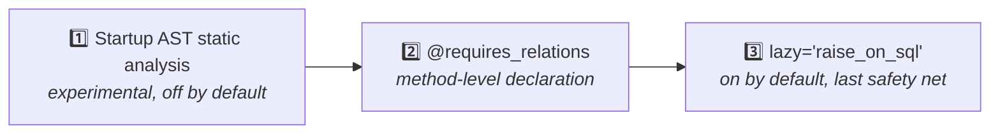

# Prevent MissingGreenlet errors

**Goal**: eliminate the runtime errors caused by "accessing a relation field that wasn't preloaded".

**Background**: understand why SQLAlchemy lazy loading doesn't fly in async — see [Prerequisites](/en/explanation/prerequisites#lazy-loading-issues-in-async).

sqlmodel-ext provides **three layers of defense**, increasingly strict:



## Third defense (always on): `lazy='raise_on_sql'`

Since 0.2.0, every `Relationship` field defaults to `lazy='raise_on_sql'`: accessing an unloaded relation **raises immediately** rather than triggering an implicit synchronous query that would cause `MissingGreenlet`.

```python
user = await User.get_exist_one(session, user_id)  # No load=
print(user.profile)  # ⚠ raise_on_sql: raises InvalidRequestError immediately
```

This defense is **automatic** — you don't have to do anything. The benefit is converting a confusing `MissingGreenlet` into a clear `InvalidRequestError: 'User.profile' is not available due to lazy='raise_on_sql'`.

## Second defense: explicit `load=`

The most common approach. Declare needed relations at query time:

```python
user = await User.get_exist_one(session, user_id, load=User.profile)
print(user.profile)  # safe
```

For nested relations, just list them:

```python
user = await User.get_exist_one(
    session,
    user_id,
    load=[User.profile, Profile.avatar],
)
# Auto-builds: selectinload(User.profile).selectinload(Profile.avatar)
```

## Second defense, advanced: `@requires_relations`

If you're writing a **model method** (not an endpoint) that accesses relation fields internally, the caller would otherwise need to know "which relations does this method touch" — a fragile contract.

`@requires_relations` declares "I need these relations" on the method itself:

```python
from sqlmodel_ext import RelationPreloadMixin, requires_relations

class Article(
    SQLModelBase,
    UUIDTableBaseMixin,
    RelationPreloadMixin,    # ← required // [!code highlight]
    table=True,
):
    author: User = Relationship()

    @requires_relations('author')                    # ← string: this class's relation name // [!code highlight]
    async def render_byline(self, session: AsyncSession) -> str:
        return f"by {self.author.name}"
```

The caller doesn't need to know anything:

```python
article = await Article.get_exist_one(session, article_id)
byline = await article.render_byline(session)  # author is auto-loaded
```

### Nested relations

Use the relation attribute reference instead of a string:

```python
@requires_relations('generator', Generator.config)
async def calculate_cost(self, session: AsyncSession) -> int:
    return self.generator.config.price * 10
```

### Incremental loading

If the caller has already preloaded part of the relations, the decorator **won't** reload them — it only fills in the missing pieces.

### Import-time validation

If you mistype `@requires_relations('typo_name')`, an `AttributeError` is raised at **module import time**, not at runtime.

## `@requires_for_update` companion decorator

If a method modifies fields and `save()`s, callers should acquire a row lock first:

```python
from sqlmodel_ext import requires_for_update

class Account(SQLModelBase, UUIDTableBaseMixin, RelationPreloadMixin, table=True):
    balance: int

    @requires_for_update                                  # ← // [!code highlight]
    async def adjust_balance(self, session: AsyncSession, *, amount: int) -> None:
        self.balance += amount
        await self.save(session)
```

Callers must first acquire a FOR UPDATE lock:

```python
account = await Account.get(session, Account.id == uid, with_for_update=True)
await account.adjust_balance(session, amount=-100)  # OK // [!code ++]

# Without the lock:
account = await Account.get_exist_one(session, uid)
await account.adjust_balance(session, amount=-100)  # RuntimeError! // [!code error]
```

The runtime check uses `session.info[SESSION_FOR_UPDATE_KEY]`.

## First defense (experimental, off by default): AST static analysis

::: warning Off by default since 0.3
The static analyzer makes assumptions about project layout (FastAPI endpoint conventions, STI inheritance, etc.). On other projects it **may produce false positives or fail to parse**. Off by default.
:::

If your project layout matches sqlmodel-ext's assumptions, opt in explicitly:

```python
# 1. As early as possible during application startup:
import sqlmodel_ext.relation_load_checker as rlc
rlc.check_on_startup = True

# 2. At the end of models/__init__.py, after configure_mappers():
from sqlmodel_ext import run_model_checks, SQLModelBase
run_model_checks(SQLModelBase)

# 3. In main.py:
from sqlmodel_ext import RelationLoadCheckMiddleware
app.add_middleware(RelationLoadCheckMiddleware)
```

Once enabled, the application scans every model method and FastAPI route at startup and warns about suspicious patterns. Rule codes (RLC001 / RLC007 etc.) are documented in [Static analyzer internals](/en/explanation/relation-load-checker).

## Decision tree

```
Are you writing a model method?
├── No (endpoint/regular function)
│   └── Use load= to preload explicitly
└── Yes
    └── Is it called from multiple places?
        ├── No → load= is fine too
        └── Yes → use @requires_relations (more robust)
```

## Related reference

- [`@requires_relations` / `@requires_for_update` full signatures](/en/reference/decorators)
- [`RelationPreloadMixin`](/en/reference/mixins#relationpreloadmixin)
- [Relation preloading mechanism explanation](/en/explanation/relation-preload)
