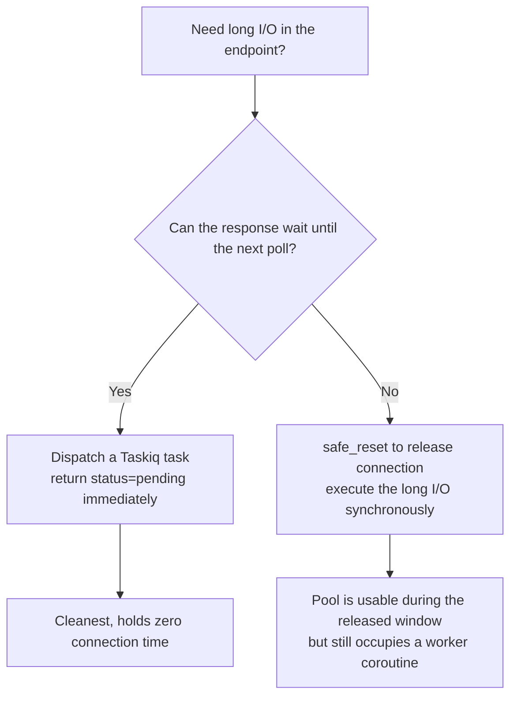

# Release the database connection during long I/O

**Goal**: prevent HTTP endpoints / background tasks from holding a database connection while doing long external I/O (S3, LLM, ffprobe, third-party HTTP polling, etc.), so the connection pool isn't exhausted by network-bound operations.

**Prerequisites**:

- Your endpoint / task needs to do both DB work and a long external network call in the same code path
- The endpoint is called concurrently (polling, batch jobs, list queries, etc.)
- Your connection pool capacity is bounded (typical production: 30-60 connections per worker)

## 1. Why this is a real problem

FastAPI's `Depends(get_session)` keeps **the same DB connection** held for the entire lifetime of the endpoint or background task. If the endpoint spends 30 seconds inside `s3.download_file()`, that DB connection is blocked on network I/O for those 30 seconds and cannot serve any other request.

**Real incident**: a project's GET endpoint synchronously executed S3 download + ffprobe metadata extraction (30+ seconds) when it detected a freshly uploaded file. With a frontend polling every 3 seconds → 30 concurrent requests × 30 seconds ≈ all 30 connections occupied → request #31 timed out after 30 seconds with a 500 → unrelated endpoints on the same worker (`/generators`, `/transactions`, …) cascaded to 500s.

```python
# ❌ Wrong: DB connection blocked by S3 download for 30 seconds
@router.get("/files/{file_id}")
async def get_file(session: SessionDep, s3: S3APIClientDep, file_id: UUID):
    file = await UserFile.get(session, UserFile.id == file_id)
    if needs_processing(file):
        # 30 seconds of network I/O — DB connection held the whole time
        data = await s3.download_file(file.bucket_id, file.key)
        metadata = await extract_metadata_via_ffprobe(data)
        file.metadata = metadata
        await file.save(session)
    return file
```

## 2. Use `safe_reset()` around the I/O block

```python
from sqlmodel_ext import safe_reset

@router.get("/files/{file_id}")
async def get_file(session: SessionDep, s3: S3APIClientDep, file_id: UUID):
    file = await UserFile.get(session, UserFile.id == file_id)
    if needs_processing(file):
        # Extract scalar fields you'll need later into local variables (see next section)
        bucket_id = file.bucket_id
        key = file.key
        file_id = file.id

        await safe_reset(session)  # ← release the DB connection // [!code ++]

        # ↓ This block holds NO DB connection — concurrent requests can use the pool
        data = await s3.download_file(bucket_id, key)
        metadata = await extract_metadata_via_ffprobe(data)

        # ↓ Any subsequent await Model.get/save automatically checks out a new connection
        file = await UserFile.get(session, UserFile.id == file_id)  # must re-query
        file.metadata = metadata
        await file.save(session)
    return file
```

**Key points**:
- `safe_reset` releases the current transaction and connection, but the session object itself stays alive (it's not closed)
- Any subsequent `await Model.get/save` that issues SQL transparently checks out a new connection from the pool
- During the released window all 30 connections are idle (unless other requests use them) — concurrent requests **are not stalled**

## 3. Object state after `safe_reset`: detached but not expired

After `safe_reset`, every ORM object in the session enters the **detached** state (no longer in `session.identity_map`), but **already-loaded scalar fields remain in `obj.__dict__`** — accessing them does not trigger a SQL query, so it does **not** raise `MissingGreenlet`.

```python
from sqlalchemy import inspect as sa_inspect

# Before safe_reset:
file = await UserFile.get(session, UserFile.id == fid)
print(sa_inspect(file).detached)  # False
print(sa_inspect(file).expired)   # False
print(file.bucket_id)             # OK, loaded

await safe_reset(session)

# After safe_reset:
print(sa_inspect(file).detached)  # True  ← note // [!code highlight]
print(sa_inspect(file).expired)   # False ← loaded fields are NOT expired // [!code highlight]
print(file.bucket_id)             # OK! scalar field access is safe // [!code ++]
print(file.parent)                # InvalidRequestError or MissingGreenlet // [!code error]
```

### Safe-access rules

| Access | After safe_reset | Why |
|--------|-----------------|-----|
| Already-loaded scalar field | ✓ Safe | In `__dict__`, no DB query |
| Already-loaded relation (preloaded via `load=`) | ✓ Safe | Same |
| Un-loaded relation | ✗ Raises | Needs lazy load, but detached can't trigger one |
| save / delete / any write | ✗ Raises | Detached objects cannot be persisted |

### Recommended style

When writing the code that runs **before** `safe_reset`, extract any field you'll need later into local variables:

```python
# Recommended:
file_id = file.id
bucket_id = file.bucket_id
key = file.key
user_id = file.user_id

await safe_reset(session)

# The code below uses local variables (file_id / bucket_id / ...),
# never touches file.X again.
```

This way, even if some field on the model becomes lazy-loaded in the future, the code won't suddenly break.

## 4. You must re-query before writing

After `safe_reset` the object is detached and **cannot be saved directly**. To write, re-query a fresh attached instance:

```python
await safe_reset(session)

# Long I/O...
metadata = await fetch_external_metadata(...)

# ❌ file is still detached — save will fail
file.metadata = metadata
await file.save(session)

# ✓ Re-query to get a fresh attached instance
file = await UserFile.get(session, UserFile.id == file_id)
file.metadata = metadata
await file.save(session)
```

## 5. When to use safe_reset vs Taskiq dispatch

`safe_reset` fits when you **must** synchronously return a result to the client. If your business can tolerate async — dispatch a job, return immediately, let the client poll — use Taskiq instead and **don't do long I/O in the HTTP endpoint at all**.



| Scenario | Recommended |
|----------|-------------|
| Polling for upload status | Taskiq (the polling client picks up the state change) |
| AI generation tasks (image/video) | Taskiq (the project's mainstream pattern) |
| Synchronous response that must contain the full result (e.g. PDF export) | safe_reset |
| WebSocket long connections | `session.close()` + per-message short-lived sessions |

## 6. Verification: did your endpoint actually release the connection?

Add this temporary logging to confirm:

```python
from sqlalchemy import event
from sqlalchemy.ext.asyncio import AsyncEngine

@event.listens_for(engine.sync_engine, "checkout")
def _on_checkout(conn, rec, proxy):
    logger.debug(f"[POOL] checkout: {engine.pool.checkedout()} / {engine.pool.size()}")

@event.listens_for(engine.sync_engine, "checkin")
def _on_checkin(conn, rec):
    logger.debug(f"[POOL] checkin:  {engine.pool.checkedout()} / {engine.pool.size()}")
```

Trigger a request that hits the long-I/O path. You should see:
1. `checkout 1/N` — endpoint starts
2. `checkin 0/N` — safe_reset fires
3. 30 seconds of external I/O with no checkout log in between
4. `checkout 1/N` — subsequent DB op
5. `checkin 0/N` — endpoint cleanup

## 7. Related

- [`safe_reset()` API reference](/en/reference/decorators#safe-reset)
- [Integrate with FastAPI](./integrate-with-fastapi)
- [Prevent MissingGreenlet](./prevent-missing-greenlet)
