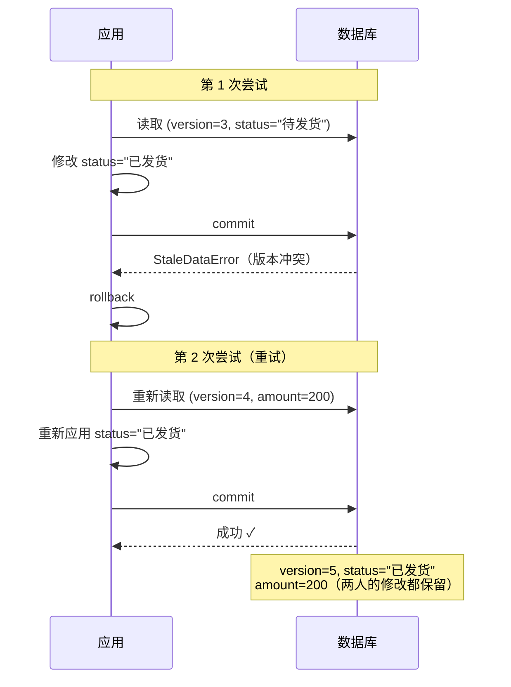

# 乐观锁机制

::: tip 源码位置
`src/sqlmodel_ext/mixins/optimistic_lock.py` — `OptimisticLockMixin` 和 `OptimisticLockError`

重试逻辑在 `src/sqlmodel_ext/mixins/table.py` 的 `save()` / `update()` 方法中
:::

## 设计动机

并发更新同一条记录会导致**丢失更新**：A 改了 status，B 同时改了 amount，谁后写谁就覆盖了对方的修改。乐观锁通过版本号检测这种冲突，让冲突可被识别、可被重试，而不是静默丢数据。

想知道**怎么用**？去 [处理并发更新](/how-to/handle-concurrent-updates)。本章只解释**为什么这么实现**。

## `OptimisticLockMixin`

整个 Mixin 惊人地简短：

```python
class OptimisticLockMixin:
    _has_optimistic_lock: ClassVar[bool] = True
    version: int = 0
```

- `_has_optimistic_lock` — 内部标记，供 `save()` / `update()` 判断是否需要处理乐观锁逻辑
- `version` — 版本号字段

SQLAlchemy 的 `version_id_col` 机制会在元类中通过 `__mapper_args__` 启用——每次 UPDATE 自动生成 `WHERE version = ?` 和 `SET version = version + 1`。

## `OptimisticLockError`

```python
class OptimisticLockError(Exception):
    def __init__(self, message, model_class=None, record_id=None,
                 expected_version=None, original_error=None):
        super().__init__(message)
        self.model_class = model_class          # "Order"
        self.record_id = record_id              # "a1b2c3..."
        self.expected_version = expected_version # 3
        self.original_error = original_error     # StaleDataError
```

携带丰富的上下文信息，方便调试和日志记录。

## 重试逻辑在 `save()` 中

`save()` 和 `update()` 有相同的乐观锁重试结构：

```python
async def save(self, session, ..., optimistic_retry_count=0):
    cls = type(self)
    instance = self
    retries_remaining = optimistic_retry_count
    current_data = None

    while True:
        session.add(instance)
        try:
            await session.commit()
            break                              # 成功

        except StaleDataError as e:            # 版本冲突！ // [!code error]
            await session.rollback()

            if retries_remaining <= 0:
                raise OptimisticLockError( # [!code error]
                    message=f"optimistic lock conflict",
                    model_class=cls.__name__,
                    record_id=str(instance.id),
                    expected_version=instance.version,
                    original_error=e,
                ) from e

            retries_remaining -= 1

            # 保存当前修改（排除元数据字段）
            if current_data is None:
                current_data = self.model_dump( # [!code focus]
                    exclude={'id', 'version', 'created_at', 'updated_at'} # [!code focus]
                ) # [!code focus]

            # 从数据库获取最新记录
            fresh = await cls.get(session, cls.id == self.id) # [!code focus]
            if fresh is None:
                raise OptimisticLockError("record has been deleted") from e

            # 把我的修改重新应用到最新记录上
            for key, value in current_data.items(): # [!code focus]
                if hasattr(fresh, key): # [!code focus]
                    setattr(fresh, key, value) # [!code focus]
            instance = fresh
```

### 重试流程可视化



### 关键实现细节

1. **`current_data` 惰性保存** — 只在第一次冲突时用 `model_dump()` 保存修改，排除 `id`、`version`、`created_at`、`updated_at` 等元数据字段。这避免了无冲突时的开销。
2. **检测记录删除** — 重新查询时如果记录已被删除，抛出专门的错误而非无限重试。
3. **重新应用修改** — 把原始修改逐字段 `setattr` 到最新记录上，然后用新版本再次尝试 commit。这种做法比"放弃后重新执行业务逻辑"简单得多——业务代码完全不感知重试存在。
