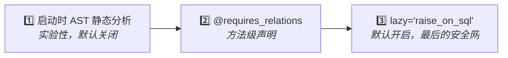

# 防止 MissingGreenlet 错误

**目标**：消除"访问未预加载的关系字段时抛 `MissingGreenlet`"这类运行时错误。

**前置知识**：理解 SQLAlchemy 的懒加载在异步环境下为什么不能直接用——见 [前置知识](/explanation/prerequisites#懒加载在异步中的问题)。

sqlmodel-ext 提供**三道防线**，从前到后逐渐严格：



## 第三道防线（默认开启）：`lazy='raise_on_sql'`

0.2.0 起，所有 `Relationship` 字段的默认 `lazy` 设置为 `'raise_on_sql'`：访问未加载的关系**立刻抛异常**，而不是触发隐式同步查询导致 `MissingGreenlet`。

```python
user = await User.get_exist_one(session, user_id)  # 没有 load=
print(user.profile)  # ⚠ raise_on_sql: 立刻抛 InvalidRequestError
```

这道防线是**自动**的，你什么都不用做。它的好处是把"错误信息"从难懂的 `MissingGreenlet` 变成清晰的 `InvalidRequestError: 'User.profile' is not available due to lazy='raise_on_sql'`。

## 第二道防线：`load=` 显式预加载

最常用的做法。在查询时声明需要的关系：

```python
user = await User.get_exist_one(session, user_id, load=User.profile)
print(user.profile)  # 安全
```

嵌套关系直接列出来：

```python
user = await User.get_exist_one(
    session,
    user_id,
    load=[User.profile, Profile.avatar],
)
# 自动构建: selectinload(User.profile).selectinload(Profile.avatar)
```

## 第二道防线进阶：`@requires_relations` 装饰器

如果你写的是**模型方法**（不是端点），而方法内部访问关系字段，那么调用方必须知道"这个方法会访问哪些关系"——这是漏洞百出的契约。

`@requires_relations` 把"我需要哪些关系"声明在方法本身：

```python
from sqlmodel_ext import RelationPreloadMixin, requires_relations

class Article(
    SQLModelBase,
    UUIDTableBaseMixin,
    RelationPreloadMixin,    # ← 必须继承 // [!code highlight]
    table=True,
):
    author: User = Relationship()

    @requires_relations('author')                    # ← 字符串：本类的关系名 // [!code highlight]
    async def render_byline(self, session: AsyncSession) -> str:
        return f"by {self.author.name}"
```

调用方什么都不用知道：

```python
article = await Article.get_exist_one(session, article_id)
byline = await article.render_byline(session)  # 自动加载 author
```

### 嵌套关系

用关系属性引用而不是字符串：

```python
@requires_relations('generator', Generator.config)
async def calculate_cost(self, session: AsyncSession) -> int:
    return self.generator.config.price * 10
```

### 增量加载

如果调用方已经预加载了一部分关系，装饰器**不会**重复加载，只补缺失的那部分。

### 导入时验证

`@requires_relations('typo_name')` 中的字符串如果拼错了，**模块导入时**就会抛 `AttributeError`——而不是等到运行时才暴露。

## `@requires_for_update` 配套装饰器

如果方法内部要修改字段并 `save()`，应该让调用方先获取行锁：

```python
from sqlmodel_ext import requires_for_update

class Account(SQLModelBase, UUIDTableBaseMixin, RelationPreloadMixin, table=True):
    balance: int

    @requires_for_update                                  # ← // [!code highlight]
    async def adjust_balance(self, session: AsyncSession, *, amount: int) -> None:
        self.balance += amount
        await self.save(session)
```

调用方必须先获取 FOR UPDATE 锁：

```python
account = await Account.get(session, Account.id == uid, with_for_update=True)
await account.adjust_balance(session, amount=-100)  # OK // [!code ++]

# 没加锁就调用：
account = await Account.get_exist_one(session, uid)
await account.adjust_balance(session, amount=-100)  # RuntimeError! // [!code error]
```

运行时通过 `session.info[SESSION_FOR_UPDATE_KEY]` 检查锁定状态。

## 第一道防线（实验性，默认关闭）：AST 静态分析

::: warning 0.3 起默认关闭
静态分析器对项目结构有特定假设（FastAPI 端点命名、STI 继承约定），在不同项目上**可能产生误报或解析失败**。默认关闭。
:::

如果你的项目结构和 sqlmodel-ext 假设一致，可以显式启用：

```python
# 1. 在应用启动最早期：
import sqlmodel_ext.relation_load_checker as rlc
rlc.check_on_startup = True

# 2. 在 models/__init__.py 末尾，configure_mappers() 之后：
from sqlmodel_ext import run_model_checks, SQLModelBase
run_model_checks(SQLModelBase)

# 3. 在 main.py 中：
from sqlmodel_ext import RelationLoadCheckMiddleware
app.add_middleware(RelationLoadCheckMiddleware)
```

启用后，应用启动时会扫描所有模型方法和 FastAPI 路由，发现可疑模式立刻警告。规则代码（如 RLC001 / RLC007）见 [静态分析器原理](/explanation/relation-load-checker)。

## 决策树

```
你写的是模型方法吗？
├── 否（端点/普通函数）
│   └── 用 load= 显式预加载
└── 是
    └── 是否被多个调用方使用？
        ├── 否 → 用 load= 也行
        └── 是 → 用 @requires_relations（更稳）
```

## 相关参考

- [`@requires_relations` / `@requires_for_update` 完整签名](/reference/decorators)
- [`RelationPreloadMixin`](/reference/mixins#relationpreloadmixin)
- [关系预加载机制讲解](/explanation/relation-preload)
