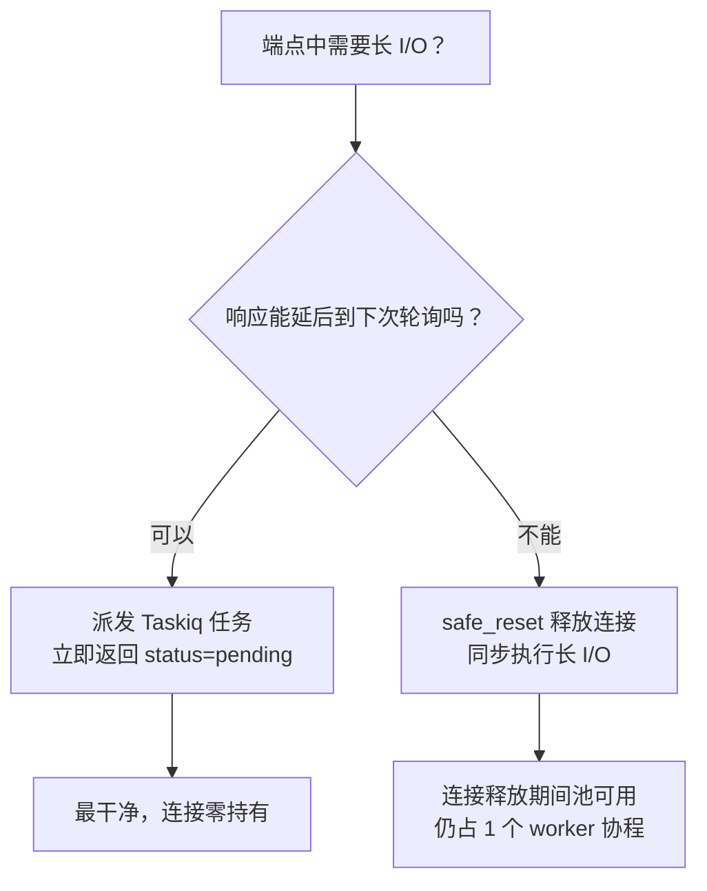

# 长 I/O 期间释放数据库连接

**目标**：防止 HTTP 端点 / 后台任务在执行长时间外部 I/O（S3、LLM、ffprobe、第三方 HTTP API 轮询等）时持有数据库连接，避免连接池被外部网络阻塞拖死。

**前置条件**：

- 你的端点 / 任务在某段代码里既需要 DB 操作，又需要长时间外部网络调用
- 该端点会被并发调用（轮询、批量任务、列表查询等）
- 你的连接池容量有限（典型生产配置：每 worker 30-60 个连接）

## 1. 为什么这是个真实问题

FastAPI 的 `Depends(get_session)` 在端点 / 后台任务执行期间**持有同一个 DB 连接**。如果端点中途调用了 30 秒的 `s3.download_file()`，这 30 秒里 DB 连接被外部网络 I/O 阻塞、不能服务其他请求。

**真实事故**：某项目 GET 端点检测到文件刚上传完成时同步执行 S3 下载 + ffprobe 元数据提取（30+ 秒）。前端 3 秒间隔轮询 → 30 个并发请求 × 30 秒 ≈ 全部 30 个连接占满 → 第 31 个请求等池超时 30 秒后 500 → 同 worker 的不相关端点（`/generators`、`/transactions` 等）级联崩溃。

```python
# ❌ 错误：DB 连接被 S3 下载阻塞 30 秒
@router.get("/files/{file_id}")
async def get_file(session: SessionDep, s3: S3APIClientDep, file_id: UUID):
    file = await UserFile.get(session, UserFile.id == file_id)
    if needs_processing(file):
        # 下面 30 秒的网络 I/O 全程占用 DB 连接
        data = await s3.download_file(file.bucket_id, file.key)
        metadata = await extract_metadata_via_ffprobe(data)
        file.metadata = metadata
        await file.save(session)
    return file
```

## 2. 用 `safe_reset()` 在 I/O 前后释放连接

```python
from sqlmodel_ext import safe_reset

@router.get("/files/{file_id}")
async def get_file(session: SessionDep, s3: S3APIClientDep, file_id: UUID):
    file = await UserFile.get(session, UserFile.id == file_id)
    if needs_processing(file):
        # 提取后续需要的 scalar 字段到局部变量（见下节解释）
        bucket_id = file.bucket_id
        key = file.key
        file_id = file.id

        await safe_reset(session)  # ← 释放 DB 连接 // [!code ++]

        # ↓ 下面这段不持有 DB 连接，并发请求可以拿到连接
        data = await s3.download_file(bucket_id, key)
        metadata = await extract_metadata_via_ffprobe(data)

        # ↓ 下面任何 await Model.get/save 会自动 checkout 一个新连接
        file = await UserFile.get(session, UserFile.id == file_id)  # 必须重查
        file.metadata = metadata
        await file.save(session)
    return file
```

**关键点**：
- `safe_reset` 释放当前事务和 connection，但 session 对象本身仍存活（不是 close）
- 后续任何 `await Model.get/save` 触发 SQL 时会自动从池 checkout 新连接
- 释放期间池有 30 个连接全部空闲（除非别的请求占用），**并发请求不会被拖死**

## 3. `safe_reset` 后对象的状态：detached 但不 expired

调用 `safe_reset` 后，session 中所有 ORM 对象进入 **detached** 状态（不在 `session.identity_map` 中），但**已加载的 scalar 字段仍在 `obj.__dict__`** —— 访问它们不会触发 SQL 查询，因此**不会抛 `MissingGreenlet`**。

```python
from sqlalchemy import inspect as sa_inspect

# Before safe_reset:
file = await UserFile.get(session, UserFile.id == fid)
print(sa_inspect(file).detached)  # False
print(sa_inspect(file).expired)   # False
print(file.bucket_id)             # OK，已加载

await safe_reset(session)

# After safe_reset:
print(sa_inspect(file).detached)  # True  ← 注意 // [!code highlight]
print(sa_inspect(file).expired)   # False ← 已加载字段没被 expire // [!code highlight]
print(file.bucket_id)             # OK！scalar 字段访问安全 // [!code ++]
print(file.parent)                # InvalidRequestError 或 MissingGreenlet // [!code error]
```

### 安全访问规则

| 访问类型 | safe_reset 后 | 说明 |
|----------|--------------|------|
| 已加载的 scalar 字段 | ✓ 安全 | 在 `__dict__` 中，无需 DB 查询 |
| 已加载的关系（`load=` 预加载过） | ✓ 安全 | 同上 |
| 未加载的关系 | ✗ 抛错 | 需要懒加载，但 detached 无法触发 |
| save / delete / 任何写操作 | ✗ 抛错 | detached 对象不能持久化 |

### 实操建议

写到 safe_reset 前的代码时，把后面要用到的字段**提前提取到局部变量**：

```python
# 推荐风格：
file_id = file.id
bucket_id = file.bucket_id
key = file.key
user_id = file.user_id

await safe_reset(session)

# 后面的代码用 file_id / bucket_id 等局部变量，
# 永远不要碰 file.X
```

这样即使将来这个对象的某个字段变成 lazy load，代码也不会突然崩溃。

## 4. 写操作前必须重新查询

`safe_reset` 后对象处于 detached 状态，**不能直接 save**。需要写操作的话，重新查询拿到 attached 实例：

```python
await safe_reset(session)

# 长 I/O ...
metadata = await fetch_external_metadata(...)

# ❌ file 还是 detached，save 会失败
file.metadata = metadata
await file.save(session)

# ✓ 重查拿 fresh attached 实例
file = await UserFile.get(session, UserFile.id == file_id)
file.metadata = metadata
await file.save(session)
```

## 5. 什么时候用 safe_reset，什么时候用 Taskiq

`safe_reset` 适合"必须同步返回结果给客户端"的场景。如果业务可以接受异步——派发任务 + 立即返回 + 客户端轮询——那应该用 Taskiq，**根本不在 HTTP 端点里做长 I/O**。



| 场景 | 推荐方案 |
|------|---------|
| 文件上传后状态轮询 | Taskiq（前端轮询能感知状态变更）|
| AI 生成任务（图片/视频） | Taskiq（项目主流模式）|
| 同步必须返回完整结果（如导出 PDF）| safe_reset |
| WebSocket 长连接 | 用 `session.close()` + 短生命周期 session（每次消息处理一个 session） |

## 6. 验证：你的端点真的释放了连接吗？

加这个临时日志确认：

```python
from sqlalchemy import event
from sqlalchemy.ext.asyncio import AsyncEngine

@event.listens_for(engine.sync_engine, "checkout")
def _on_checkout(conn, rec, proxy):
    logger.debug(f"[POOL] checkout: {engine.pool.checkedout()} / {engine.pool.size()}")

@event.listens_for(engine.sync_engine, "checkin")
def _on_checkin(conn, rec):
    logger.debug(f"[POOL] checkin:  {engine.pool.checkedout()} / {engine.pool.size()}")
```

跑一个能触发长 I/O 的请求，应该看到：
1. `checkout 1/N` 端点开始
2. `checkin 0/N` safe_reset 触发
3. 30 秒外部 I/O，期间没有 checkout 日志
4. `checkout 1/N` 后续 DB 操作触发
5. `checkin 0/N` 端点 cleanup

## 7. 相关参考

- [`safe_reset()` API 参考](/reference/decorators#safe-reset)
- [集成 FastAPI](./integrate-with-fastapi)
- [防止 MissingGreenlet 错误](./prevent-missing-greenlet)
